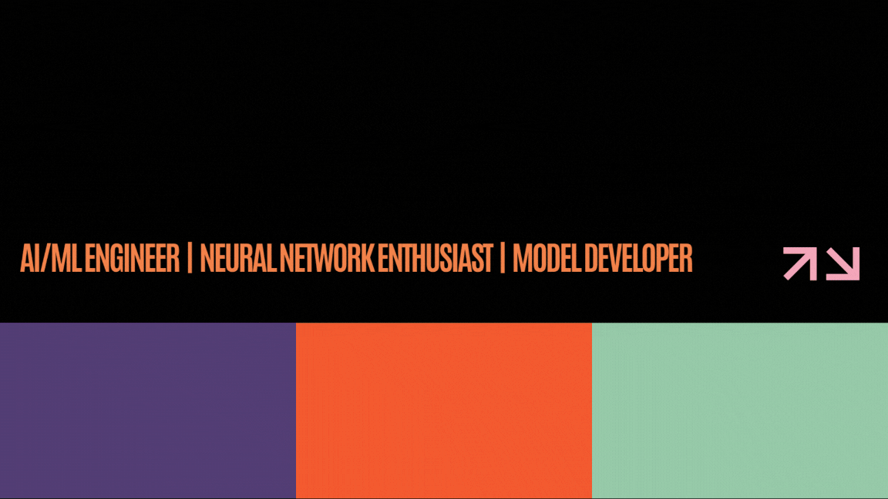

<!-- 🖼️ YOUR TOP GIF GOES HERE -->
<!-- To display your GIF, uncomment the line below by removing the <!-- and --> 
<!-- Then, replace 'YOUR_GIF_URL_OR_PATH_HERE' with your actual GIF link -->
<!--  -->

## Hi there 👋 I'm Alan

*building. learning. creating.*

*A Artificial Intelligence and Machine Learning student passionate about AI, Machine Learning, Neural Networks, and Intelligent Systems. I enjoy transforming ideas into practical applications, whether it's developing AI-powered tools, training machine learning models, or building autonomous robotic systems.*
---

### 🚀 What I Do and still learning ⏩ 

* **🤖Artificial Intelligence & Machine Learning**: Actively building models and web applications using **Python** and **Streamlit**.
* **🧠 Natural Language Processing**: Building and experimenting with language models, semantic analysis, and multimodal systems to process textual and contextual data.
* **🚗Robotics & Navigation**: Exploring mobile robot kinematics, sensor integration, and advanced navigation strategies.
* **💡Algorithmic Problem Solving**: Trying to learn and solving coding challenges, optimizing algorithms, and strengthening problem-solving skills through data structures and competitive programming.
* **🧠Artificial Neural Network**: Exploring neural network architectures, learning algorithms, and their applications in intelligent systems.
---

### 🤝 Connect With Me

Let's collaborate on innovative AI/ML projects, robotic systems, or upcoming hackathons! 

  
  
  

 

---

<!-- Visitor Counter Badge -->

  

